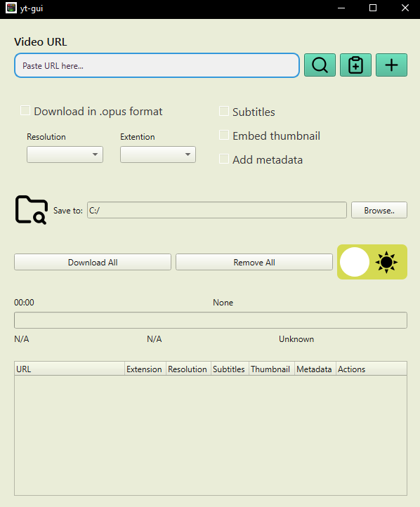

This tool was built with a focus on YouTube. While yt-dlp supports many platforms, 
this GUI is optimized for YouTube workflows. As the developer, I designed it with
specific use cases in mind and I reached them.
The interface is built with PySide6.

Note: The UI is currently optimized for its default window size. 
While it handles basic tasks perfectly, it is not yet fully 
responsive to extreme window stretching.

The project is licensed under the MIT License. I’ve built the core foundation, and the source code is completely open. If you have the patience to polish the styles or want to improve the layout responsiveness, contributions are highly welcome! Feel free to fork, tweak, and improve it however you see fit.

here is preview: 



## Installation
1. Clone the repository:
  ```bash
   git clone https://github.com/Asatoniko/yt-dlp-gui.git
   cd yt-dlp-gui
   poetry install # if you don't have poetry: pip install poetry
   poetry run yt-gui

2. Since you are using yt-dlp it's necessary to download ffmpeg:
  - **Windows:** [Download via Gyan.dev](https://www.gyan.dev)
  - **macOS:** `brew install ffmpeg`
  - **Linux:** `sudo apt install ffmpeg`
